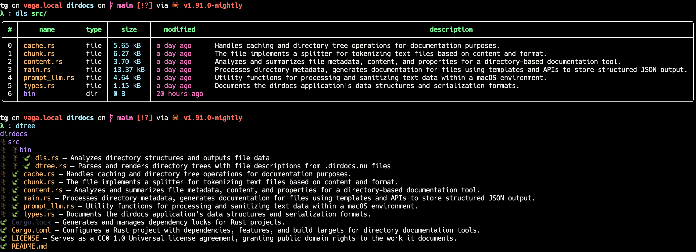

# dirdocs

`dirdocs` is a Rust-powered CLI that **provides file level documentation** by leveraging an LLM.
  
It walks a directory (respecting `.gitignore` and extra ignores), hashes files, and for each *new or changed* file, it queries an LLM using the [Awful Jade](https://github.com/graves/awful_aj) configuration + prompt templates.

The result is stored in a `.dirdocs.nu` file at the project root — a **Nuon-compatible JSON tree** of files, each annotated with descriptions, joy metrics, and personality emojis.

```
                      .`.
                    .`~.-:
                  .`- . -`
                .`-  . -`
              .`-   . -`
            .`-    . -`
          .`-     . -`
         `-      . -`
       .`-      . -`
      ;-       . -`
     .-      .  -`
    ;.      . -`
   ;.     . -`
   ::._.-`
   (.-`
   .Y(.
  ((()))
  _)==(_
 | .--. |
 | '--' |
 '------' LGB(plus at least two more letters)
 ```

---

## 🚀 How it works

1. **Scan** — Uses [`ignore::WalkBuilder`](https://docs.rs/ignore) to walk the project, applying `.gitignore`, global gitignore, excludes, and hidden rules.
2. **Cache merge** — Loads previous `.dirdocs.nu` and any subdirectory caches so unchanged files are skipped.
3. **Hash** — Uses content hashing to detect dirty vs clean files.
4. **Template render** — Builds a YAML-based LLM prompt from `dir_docs.yaml` in your `awful_jade` config directory.
5. **LLM call** — Uses `awful_aj::ask` with exponential backoff to request descriptions.
6. **Merge + write** — Updates `.dirdocs.nu` in place with new/changed entries, preserving older cached docs.
7. **Works extremely well with the** [Qwen 3 4B model I Finetuned](https://huggingface.co/dougiefresh/jade_qwen3_4b) for **Systems Programming** related queries.

> 💡 Use with the included `dls` and `dtree` binaries or replace Github commit messages with the [Chrome Extension](https://chromewebstore.google.com/detail/dirdocs-for-github/mlkaknhkcakopeghpgmnpdjdfcffbain?hl=en).

---

## 📦 Installation

```bash
cargo install dirdocs
```

---

## 👷🏽‍♀️ Setup (steps will vary according to your operating system)

1. Install conda python version manager.

```bash
brew install miniconda
```

2. Create Python 3.11 virtual environment named aj and activate it.

```bash
conda create -n aj python=3.11
conda activate aj
````

3. Install pytorch 2.4.0

```bash
pip install torch==2.4.0
````

4. Add the following to your shell initialization.

```bash
export LIBTORCH_USE_PYTORCH=1
export LIBTORCH='/opt/homebrew/Caskroom/miniconda/base/pkgs/pytorch-2.4.0-py3.11_0/lib/python3.11/site-packages/torch' # Or wherever Conda installed libtorch on your OS
export DYLD_LIBRARY_PATH="$LIBTORCH/lib"

conda activate aj
```

---

## ⚙️ Usage

### Initialize the template and configuration

```bash
dirdocs init
```

### Generate file level documentation

```bash
dirdocs [OPTIONS]
```

### Flags

- `-d, --directory <PATH>` — Root directory to scan (default `.`).
- `-i, --ignore <NAMES>` — Extra directories to ignore (comma-separated or repeatable).
- `-f, --force` — Force regeneration for *all* files, even if unchanged.

### Examples

```bash
# Document the current project
dirdocs

# Document another directory
dirdocs --directory ~/Projects/my-app

# Ignore build artifacts
dirdocs --ignore target,node_modules,dist

# Regenerate everything
dirdocs --force
```

---

## 📄 Output: `.dirdocs.nu`

Example snippet:

```json
{
  "root": "src",
  "updated_at": "2025-10-01T12:34:56Z",
  "entries": [
    {
      "kind": "file",
      "name": "main.rs",
      "path": "src/main.rs",
      "hash": "f1a23c...",
      "updated_at": "2025-10-01T12:34:56Z",
      "doc": {
        "fileDescription": "Main entrypoint wiring CLI args to internal modules.",
        "joyThisFileBrings": 7,
        "personalityEmoji": "🦀"
      }
    }
  ]
}
```

- Fully Nuon-compatible (readable in [Nushell](https://www.nushell.sh/)).
- Is used by `dls` and `dtree` to produce colorized tree listings with inline docs.



---

## 🔧 Configuration

- Reads `Awful Jade` config from `~/.config/com.awful-sec.aj/config.yaml`.
- Uses a Handlebars template:  
  `~/.config/com.awful-sec.aj/templates/dir_docs.yaml`  
  (You can customize the YAML to change prompt formatting.)

---

## 🧩 Included Binaries

- `dls` — `ls`-style directory listings with `.dirdocs.nu` docs attached.
- `dtree` — tree-style visualization with emoji 🌿 or ASCII connectors.

Together with `dirdocs`, they form a documentation-aware `tree` + `ls`.

---

## 🛠 Roadmap

- [ ] Implement a [Bionic Font](https://github.com/ThereOHM/Fast-Font/blob/main/README_Tech.md) algorithm to make walls of text easier to read.
- [ ] Richer JSON schema with symbol lists and token counts.
- [ ] Integration with `rust_ast.nu` for Rust-specific symbol trees.

---

## 🤝 Contributing

PRs welcome!  
- Improve template logic.
- Expand test coverage.

---

## 📜 License

This project is licensed under [CC0 1.0 Universal (Public Domain Dedication)](https://creativecommons.org/publicdomain/zero/1.0/).  

You can copy, modify, distribute, and perform the work, even for commercial purposes, all without asking permission.
